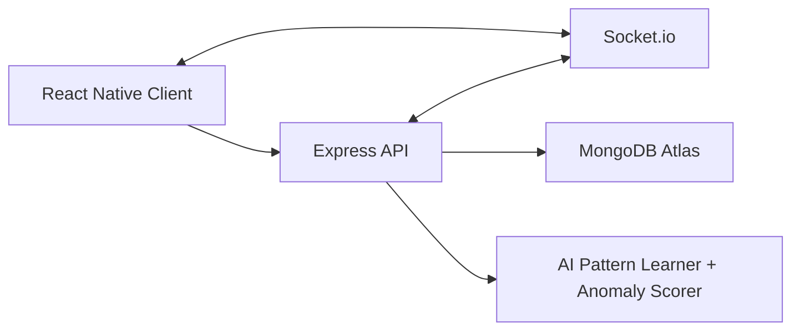

# Kwenchana Hackathon V1 Design Doc

**Status:** Active Development  
**Date:** March 13, 2026  
**Target:** Functional iOS simulator demo

## 1. Overview

Kwenchana is an ambient care application designed to reduce the anxiety of "text me when you get home" without defaulting to invasive live tracking. Instead of continuously exposing a person's location to their circle, Kwenchana converts movement behavior into a lightweight safety signal that trusted contacts can understand at a glance.

For the hackathon, the goal is to prove one core loop end to end:

1. The app collects or simulates location updates.
2. An AI agent learns recurring locations and movement patterns, then detects when the user's behavior looks unusual.
3. Their Nest sees a status change immediately.
4. A Nest member sends a one-tap care message.
5. The user resolves the situation with one tap, or the system escalates if they do not respond.

This version prioritizes demo reliability, clarity of UX, and a believable learning loop over production-scale modeling.

## 2. Problem Statement

Most safety apps sit at one of two extremes:

- They rely on continuous GPS sharing, which can feel intrusive.
- They depend on manual check-ins, which are easy to forget.

Kwenchana introduces **ambient care**: low-friction, privacy-conscious awareness that communicates "something may be off" without requiring constant surveillance.

## 3. Hackathon Goal

Build an iOS simulator demo that shows:

- AI-assisted movement pattern learning from recent and historical location context
- automatic labeling of recurring safe locations by the AI agent
- a user's status changing from `GREEN` to `YELLOW` when an anomaly is detected
- real-time propagation of that state to Nest members
- one-tap care nudges using predefined message templates
- one-tap quick replies using predefined response options
- automatic or manual escalation to `RED`

## 4. Non-Goals for Hackathon V1

- No production-scale offline training pipeline or months of live history before the demo works
- No production-grade guarantees for background processing
- No full trust-and-safety workflow
- No native iOS home screen widget requirement for demo success
- No AI-generated message copy as a core dependency

Note: a true iOS home screen widget requires native iOS work (`WidgetKit`) and should be treated as stretch scope. The required demo surface is an in-app, widget-style status card that behaves like the future widget.

## 5. Product Principles

- **Care, not surveillance:** Nest members primarily see a state signal, not raw coordinates.
- **AI where it matters:** AI should learn recurring patterns and label likely safe locations automatically.
- **User override exists:** a user can manually mark a location as safe, but that is a fallback, not the core intelligence.
- **Low friction:** one tap to check in, one tap to respond.
- **Explainable states:** the app should be able to show why a state changed.
- **Demo-first reliability:** preloaded history is acceptable to bootstrap the learning demo, but the product story should still be automatic learning.

## 6. Primary User Flow

### 6.1 Normal Flow

1. A user belongs to a Nest with trusted contacts.
2. The AI agent builds a memory of recurring locations, visit frequency, dwell times, and routine windows.
3. The user can also manually mark a location as safe if needed.
4. The backend evaluates incoming movement data against the learned pattern memory.
5. If the behavior looks normal or matches a learned safe location, the user's card remains `GREEN`.

### 6.2 Anomaly Flow

1. The user moves in a way that differs from their learned pattern.
2. The backend derives movement features from recent location updates.
3. The AI agent compares the visit against learned locations and expected routine context.
4. If the place appears recurring, the AI agent can automatically label it as a safe or likely-safe location with confidence.
5. If the behavior still looks unusual, the backend marks the user `YELLOW`.
6. Nest members immediately see the updated card via Socket.io.
7. A Nest member taps the card and sends a one-tap care nudge from a predefined template.
8. The user receives the nudge and sees three predefined quick replies.
9. If the user taps a safe reply, the state returns to `GREEN`.

### 6.3 Escalation Flow

The status moves to `RED` if:

- the user manually triggers SOS
- the user does not respond within the configured response window after a `YELLOW` care nudge is sent
- a Nest member manually escalates during the demo

For Hackathon V1, the recommended response timeout is 10 minutes from the first care nudge.

## 7. User Experience

The core interface is a set of rectangular, color-coded status cards.

- `GREEN`: safe, expected movement, or low anomaly score
- `YELLOW`: unusual movement pattern or unfamiliar location detected
- `RED`: urgent state, SOS, or no response after a care nudge

Each card should show:

- user name
- current state color
- short status text
- elapsed time since state change
- short anomaly reason when available
- learned or manual location label when available
- primary action when applicable

Example copy:

- `GREEN`: "Aisha's movement looks normal."
- `YELLOW`: "Aisha is at a location the system does not yet recognize as safe."
- `RED`: "Aisha has not responded and may need urgent attention."

## 8. Technical Approach

### 8.1 Stack

- **Client:** React Native + Expo
- **Backend:** Node.js + Express
- **Realtime:** Socket.io
- **Database:** MongoDB Atlas
- **AI layer:** movement learning and anomaly recognition service fed with structured location features

### 8.2 Architecture



### 8.3 Architectural Notes

- The mobile client is responsible for collecting or simulating location updates.
- The backend derives movement features from raw location data and remains the source of truth for state transitions.
- The AI layer learns recurring places, assigns location labels with confidence, and scores anomalies.
- Care nudges and quick replies are template-based so messaging stays fast and predictable.
- Socket.io broadcasts status changes to all Nest members in real time.

This keeps the AI focused on the product's core intelligence: learning which places and routines look normal, then deciding when behavior looks unusual.

## 9. State Model

Kwenchana uses a simple state machine with AI-assisted location learning and anomaly detection.

### 9.1 States

- `GREEN`
- `YELLOW`
- `RED`

### 9.2 Transition Rules

- `GREEN -> YELLOW`
  - AI anomaly score exceeds the configured threshold for a sustained period and the current place is not recognized as safe
- `YELLOW -> GREEN`
  - user checks in manually or selects a safe quick reply
- `YELLOW -> RED`
  - user triggers SOS manually, or the response timeout is reached after a care nudge
- `RED -> GREEN`
  - demo-only manual resolution by the user or Nest member

Recommended defaults for Hackathon V1:

- anomaly dwell window: 50 minutes of unusual movement before `YELLOW`
- response timeout: 10 minutes after the first `YELLOW` care nudge

## 10. Movement Pattern Learning and Safe Location Labeling

Hackathon V1 uses a lightweight AI-assisted learning loop. The product should support manual safe labeling, but the primary behavior is the AI agent learning recurring places and movement patterns automatically.

### 10.1 Learning Model

The system should combine three sources of truth:

- AI-learned recurring locations
- AI-learned routine patterns such as commute windows or repeated stops
- user-confirmed safe locations as an override

For demo reliability, preloaded visit history is acceptable to bootstrap the agent's learned memory.

### 10.2 Feature Extraction

For each location update, the backend derives structured features such as:

- distance from nearest known location cluster
- visit frequency at the current location
- time since last visit
- dwell duration at the current location
- time of day and day of week
- speed or stationary duration
- route deviation from the learned expected pattern
- recent response or resolution history for similar situations

### 10.3 Learning and Labeling

The backend sends a compact movement summary or feature vector to the AI agent. The agent returns:

- location cluster identity or new-cluster suggestion
- learned label such as `Home`, `Work`, `Gym`, or `Frequent Stop`
- label confidence
- anomaly score
- anomaly reason such as `off-route at late hour` or `extended dwell in unfamiliar area`

### 10.4 Manual Safe Labeling

Users should be able to manually mark the current location as safe. This acts as:

- a fast correction when the AI is uncertain
- a trust-building override for the user
- a training signal that increases confidence for future visits to the same location

Manual labeling is a fallback and trust mechanism, not the primary product story.

### 10.5 Decision Logic

1. Receive a location update.
2. Derive movement features.
3. Update or compare against learned location clusters.
4. Ask the AI agent for a location label, confidence score, and anomaly score.
5. If confidence is high enough, store or refresh the learned safe location label.
6. If the anomaly score is below threshold, keep or return the user to `GREEN`.
7. If the anomaly score is above threshold and persists long enough, mark the user `YELLOW`.
8. When a care nudge is sent, start the response timer.
9. If no response arrives before the deadline, escalate to `RED`.

For the demo, location can be driven by:

- Xcode simulator route playback
- seeded mock coordinates
- a local debug control that advances state intentionally

## 11. Care Messaging and Response Flow

The care workflow should be fast, warm, and deterministic. It does not require AI text generation.

### 11.1 Care Nudge

When a Nest member taps a `YELLOW` card:

- the client calls the backend
- the backend sends a predefined care message template
- the backend records `lastCareNudgeAt`
- the backend starts a response timer

Example care message:

"Hey Aisha, your movement looked unusual and we just wanted to check in. Are you okay?"

### 11.2 Quick Replies

The receiving user sees three predefined quick replies, such as:

- "I'm safe, just delayed."
- "On my way home now."
- "Can't talk, but I'm okay."

Quick replies should be short, reassuring, and easy to tap.

If no acknowledgment or quick reply is received before the response timer expires, the backend automatically escalates the user from `YELLOW` to `RED` and broadcasts the update to the Nest.

## 12. Data Model

The schema should stay minimal but still support AI learning, safe location labeling, state transitions, and the full demo loop.

### 12.1 Users

```json
{
  "_id": "ObjectId",
  "name": "Aisha",
  "nestId": "ObjectId",
  "status": "GREEN",
  "lastKnownLocation": {
    "type": "Point",
    "coordinates": [-122.4194, 37.7749]
  },
  "statusChangedAt": "2026-03-13T18:00:00Z",
  "lastAnomalyScore": 0.12,
  "lastAnomalyReason": "normal weekday commute",
  "currentLocationLabel": "Home",
  "currentLocationLabelSource": "ai_learned",
  "outsideSafeZoneSince": null,
  "lastCareNudgeAt": null,
  "responseDeadlineAt": null
}
```

### 12.2 Nests

```json
{
  "_id": "ObjectId",
  "nestName": "Family",
  "members": ["userId1", "userId2", "userId3"]
}
```

### 12.3 SafeLocations

```json
{
  "_id": "ObjectId",
  "userId": "ObjectId",
  "label": "Home",
  "center": {
    "type": "Point",
    "coordinates": [-122.4194, 37.7749]
  },
  "radiusMeters": 300,
  "source": "ai_learned",
  "confidence": 0.94,
  "visitCount": 18,
  "userConfirmed": false,
  "lastVisitedAt": "2026-03-13T17:40:00Z"
}
```

### 12.4 PatternProfiles

```json
{
  "_id": "ObjectId",
  "userId": "ObjectId",
  "label": "Weekday commute",
  "days": ["MON", "TUE", "WED", "THU", "FRI"],
  "startWindow": "08:00",
  "endWindow": "10:00",
  "anchors": ["Home", "Campus"],
  "source": "ai_learned"
}
```

### 12.5 Events

```json
{
  "_id": "ObjectId",
  "userId": "ObjectId",
  "type": "ANOMALY_DETECTED",
  "statusBefore": "GREEN",
  "statusAfter": "YELLOW",
  "createdAt": "2026-03-13T18:50:00Z",
  "metadata": {
    "anomalyScore": 0.87,
    "reason": "extended dwell in unfamiliar area",
    "locationLabel": "Frequent Stop",
    "locationLabelConfidence": 0.41
  }
}
```

The `Events` collection is optional but strongly recommended because it makes the demo easier to debug and narrate.

## 13. API Design

### 13.1 `POST /api/location/check`

Purpose:

- receive a location update
- derive movement features
- update location learning state
- call the AI pattern learner and anomaly scorer
- compute any state transition

Request body:

```json
{
  "userId": "abc123",
  "coordinates": [-122.4194, 37.7749],
  "timestamp": "2026-03-13T18:30:00Z"
}
```

Response:

```json
{
  "status": "YELLOW",
  "anomalyScore": 0.87,
  "anomalyReason": "extended dwell in unfamiliar area",
  "locationLabel": "Frequent Stop",
  "locationLabelConfidence": 0.41
}
```

### 13.2 `POST /api/locations/mark-safe`

Purpose:

- manually mark the current location as safe
- override a low-confidence or unknown location classification
- feed a confirmed training signal back into the learning model

### 13.3 `POST /api/state/update`

Purpose:

- manually update status
- support SOS, resolution, and demo controls

### 13.4 `POST /api/messages/nudge`

Purpose:

- send a predefined care message for a `YELLOW` state
- start the no-response escalation timer

Suggested input:

```json
{
  "userId": "abc123",
  "senderId": "def456",
  "templateKey": "care_check_in"
}
```

### 13.5 `POST /api/messages/reply`

Purpose:

- record the selected quick reply
- resolve the state or keep monitoring

### 13.6 Socket Events

Suggested events:

- `status:updated`
- `pattern:learned`
- `location:labeled`
- `message:sent`
- `reply:selected`
- `status:auto-escalated`

## 14. Demo Plan

The demo should be reliable enough to present without depending on uncertain background behavior.

### 14.1 Recommended Demo Setup

- one monitored user in an iOS simulator
- one Nest member in a second simulator, second device, or simple web debug client
- preloaded visit history or seeded learned locations in MongoDB to bootstrap the agent
- scripted route deviation to trigger the anomaly on cue
- one manual "mark safe" action available as a fallback demo path

### 14.2 Demo Script

1. Show user in `GREEN`.
2. Show a learned location label such as `Home` or `Campus` and a low anomaly score.
3. Simulate repeated visits to a new place and show the AI agent learning and labeling it.
4. Deviate from the expected route or dwell at an unfamiliar location.
5. Show the anomaly score rising until the user transitions to `YELLOW`.
6. Show the real-time status update on a Nest member screen.
7. Send a predefined care nudge.
8. Either select a quick reply and return the user to `GREEN`, or wait past the response timeout.
9. Show automatic escalation from `YELLOW` to `RED` when there is no response.
10. Optionally show manual "mark safe" as a fallback correction path or manual SOS as a separate urgent path.

## 15. Risks and Mitigations

### 15.1 Background Location Limitations

Risk:

- true background behavior is difficult to guarantee in a hackathon demo

Mitigation:

- use simulator routes, mock location updates, and explicit demo controls

### 15.2 Anomaly Model False Positives

Risk:

- the AI layer may flag behavior as unusual too aggressively

Mitigation:

- preload predictable visit history, use a visible anomaly score and label confidence, and allow manual safe-label overrides

### 15.3 Home Screen Widget Scope

Risk:

- a native iOS widget adds significant complexity if the app is primarily Expo-based

Mitigation:

- treat WidgetKit as stretch scope and keep the main demo in-app

## 16. Success Criteria

Hackathon V1 is successful if the team can demonstrate:

- AI-assisted learning of recurring movement patterns from mocked or simulated location updates
- automatic labeling of recurring safe locations
- real-time state sync across Nest members
- explainable `GREEN`, `YELLOW`, and `RED` transitions
- one-tap care nudges using predefined templates
- one-tap predefined replies that resolve the state
- manual safe-label override as a fallback
- automatic escalation to `RED` after a no-response timeout
- a polished, understandable UI for the full care loop

## 17. Future Extensions

- richer personalized routine learning from longer history
- stronger automatic semantic labeling of places
- real native iOS widget support
- push notifications
- better explainability for anomaly decisions
- richer Nest permissions and roles
- privacy controls for data retention and location precision

## 18. Summary

Kwenchana V1 should focus its AI on the part that actually differentiates the product: learning which places and movement patterns are normal, labeling those locations automatically, and surfacing anomalies without exposing constant live tracking. Messaging can stay simple and deterministic. Manual safe-labeling should exist as a trust-building override, but the product story is that the AI agent becomes smarter over time and carries most of the burden automatically.
